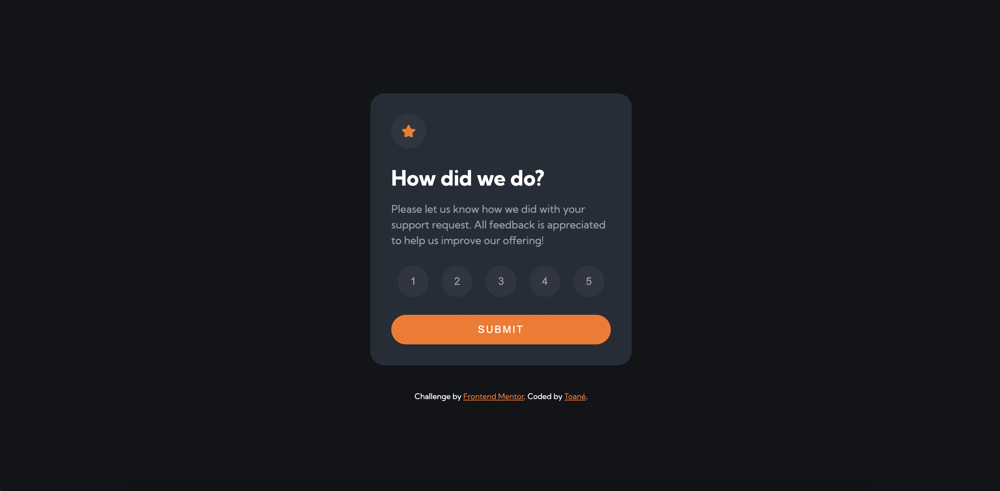

# Frontend Mentor - Interactive rating component solution

This is a solution to the [Interactive rating component challenge on Frontend Mentor](https://www.frontendmentor.io/challenges/interactive-rating-component-koxpeBUmI). Frontend Mentor challenges help you improve your coding skills by building realistic projects. 

## Table of contents

- [Overview](#overview)
  - [The challenge](#the-challenge)
  - [Screenshot](#screenshot)
  - [Links](#links)
- [My process](#my-process)
  - [Built with](#built-with)
- [Author](#author)

**Note: Delete this note and update the table of contents based on what sections you keep.**

## Overview

### The challenge

Users should be able to:

- View the optimal layout for the app depending on their device's screen size
- See hover states for all interactive elements on the page
- Select and submit a number rating
- See the "Thank you" card state after submitting a rating

### Screenshot



### Links

- Solution URL: [https://www.frontendmentor.io/solutions/interactive-rating-component-ZgUnuI2ZCd]
- Live Site URL: [https://coder-txane.github.io/interactive-rating-component-main/]

## My process

### Built with

- Semantic HTML5 markup
- CSS custom properties
- Flexbox
- Mobile-first workflow
- JavaScript


### What I learned

I learned the importance of using if-else statements, especially within event listeners. Moreso, I learned how to access and modify CSS code within JavaScript.

```js
if (ratingPage.style.display !== 'none') {
        ratingPage.style.display = 'none';
        thankYouPage.style.display = 'flex';
        ratingResult.innerHTML = `You selected ${rating} out of 5`;
    }
```

If you want more help with writing markdown, I'd recommend checking out [The Markdown Guide](https://www.markdownguide.org/) to learn more.
-->

## Author

- Frontend Mentor - [@yourusername](https://www.frontendmentor.io/profile/coder-txane)
